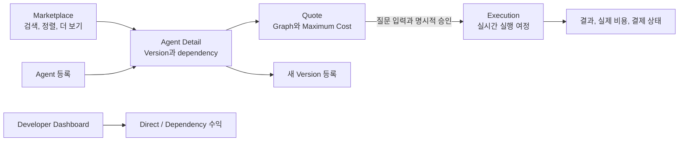
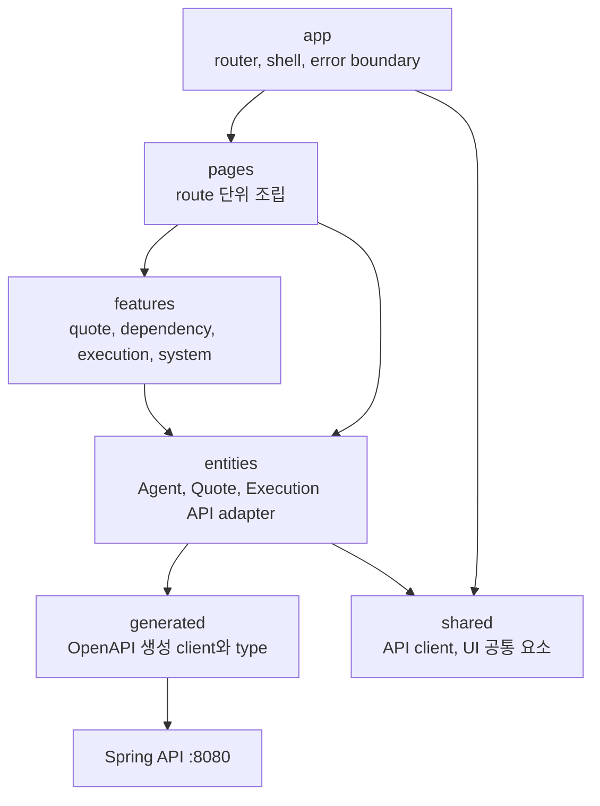
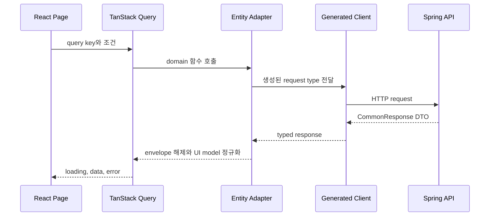
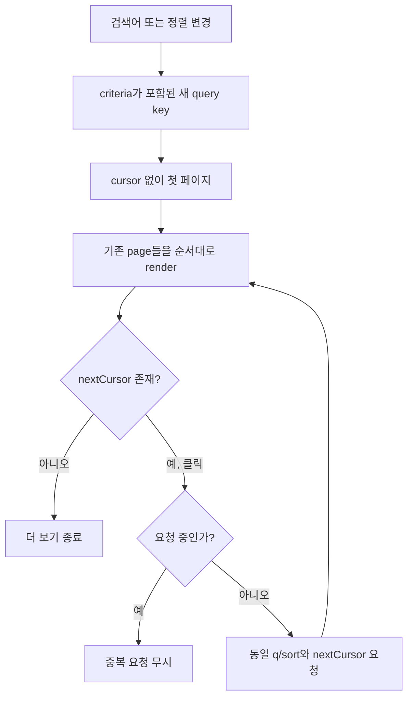
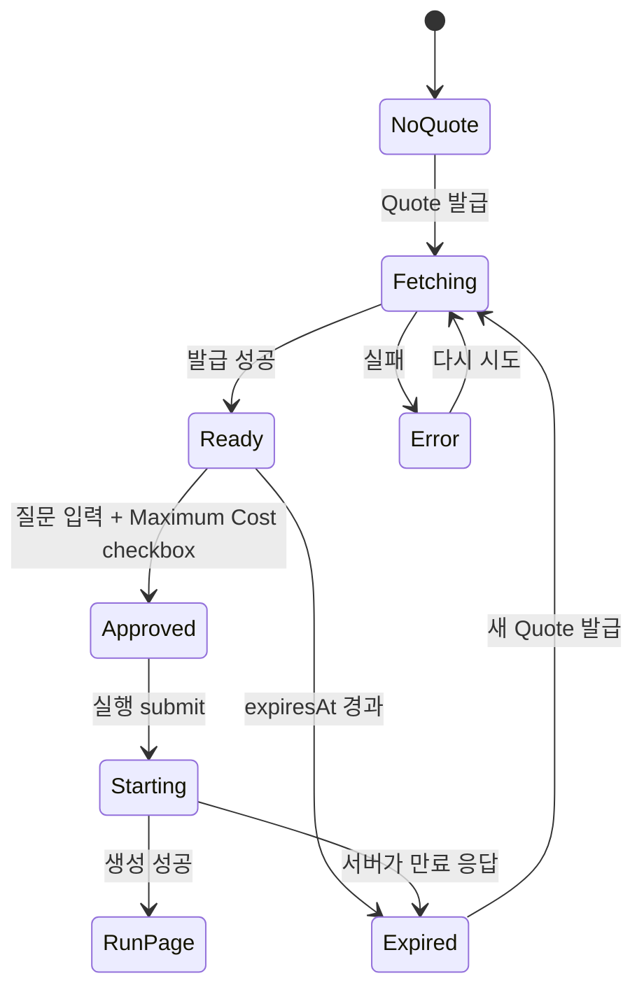
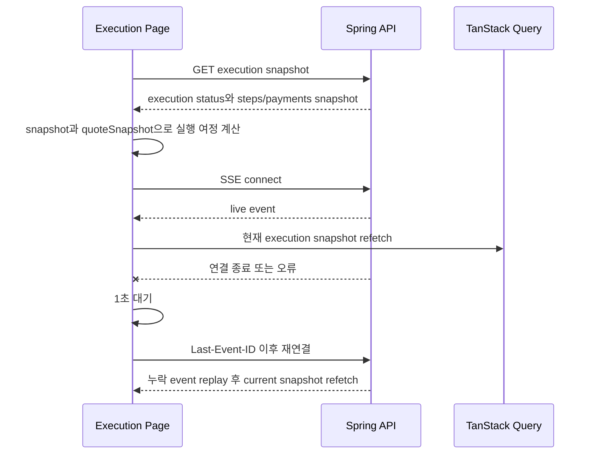
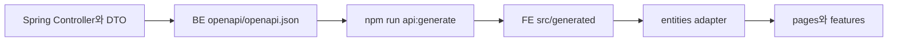

# AgentStore FE

AgentStore의 React 19 + TypeScript + Vite 프론트엔드입니다. 사용자는 Marketplace에서 Agent를 찾고, 의존성과 Maximum Cost를 확인해 실행을 승인한 뒤, SSE로 실행·결제 과정을 봅니다. 개발자는 Agent/Version/dependency를 관리하고 수익을 확인합니다.

전체 Quote 계산, 실행, 결제, 복구 규칙은 병행 백엔드 저장소의 `README.md`가 기준이며 이 문서는 브라우저가 그 계약을 어떻게 안전하게 표현하는지 설명합니다.

## 1. 화면에서 가능한 일



| URL | 화면 | 중요한 동작 |
|---|---|---|
| `/` | Landing | 원클릭 데모 시작과 Function Contract → Quote → x402 증명 |
| `/marketplace` | Marketplace | 서버 검색·정렬, cursor pagination, ACTIVE Agent 카드 |
| `/agents` | redirect | `/marketplace`로 이동 |
| `/agents/new` | Agent 등록 | Agent와 최초 Version, 응답 형식 입력 |
| `/agents/:code` | Agent Detail | Version publish/disable, dependency 관리, Quote/실행 |
| `/agents/:code/versions/new` | Version 등록 | endpoint, 가격, network, asset, payTo, 응답 형식 입력 |
| `/runs/:id` | Execution | 초기 snapshot + SSE 실행 여정, 결과와 결제 표시 |
| `/developer/revenue` | 개발자 대시보드 | owned Agent/readiness, 실제 testnet verify, 수익과 거래 참조 |
| `/settings` | 연결 정보 | 적용 중인 API URL과 demo access 상태 |
| 그 외 | 404 | Marketplace 복귀 링크 |

## 2. FE 구조



- `src/app`: route, 공통 shell, 최상위 error boundary.
- `src/pages`: URL 단위 화면 조립. 서버 계약을 직접 재구현하지 않습니다.
- `src/features`: Quote 승인, dependency graph, 실행 여정과 SSE 연결 같은 사용자 동작.
- `src/entities`: 생성 API를 호출하고 `CommonResponse`를 풀어 화면 model로 변환.
- `src/shared`: API base URL, 공통 오류, UI utility.
- `src/generated`: OpenAPI에서 생성됩니다. **직접 수정하지 않습니다.**

TanStack Query가 서버 상태와 mutation을 관리합니다. React local state는 질문, checkbox, dialog처럼 화면 안에서만 필요한 상태에 사용합니다.

## 3. API 데이터가 화면에 도착하는 과정



생성 client는 HTTP 계약을 보장하고 adapter는 화면 친화 model을 만듭니다. 오류 응답은 `ApiRequestError`로 정규화되어 `errorCode`, message, 재시도 여부를 UI가 일관되게 판단합니다. `X-Trace-Id`는 장애 추적 header이며 인증값이 아닙니다.

금액은 `priceAtomic`, `maxCostAtomic`, `actualCostAtomic` 같은 decimal string으로 유지합니다. FE는 이를 `Number`로 계산하지 않고 `formatAtomicUsdc()` 같은 formatter로 사람이 읽는 label을 만듭니다.

## 4. Marketplace 상세 로직

검색과 정렬은 브라우저가 전체 목록을 받아 처리하지 않고 서버에 위임합니다.

- query: `q`, `sort`, `cursor`, `limit`을 그대로 API에 전달합니다.
- sort: `NEWEST`, `NAME_ASC`.
- pagination: 첫 응답의 `nextCursor`를 다음 요청에 전달합니다.
- 검색어나 정렬이 바뀌면 별도 query key가 되어 이전 cursor와 섞이지 않습니다.
- 같은 tick에 더 보기 요청이 겹치지 않도록 lock을 둡니다.
- loading, 빈 결과, 오류, retry, 다음 페이지 loading을 서로 다른 상태로 표시합니다.
- 카드의 Version 수는 `versions.length`가 아니라 서버 집계 `dependencyCount`를 표시합니다. 이름은 기존 UI 문구를 유지하지만 값의 의미는 서로 다른 dependency Agent 수입니다.



## 5. Agent와 Version 관리

- Agent 등록은 code/name/description과 최초 Version 계약을 함께 전송합니다.
- 새 Version은 semver, endpoint, atomic price, network, asset, payTo와 응답 형식을 입력합니다. 기본값은 `JSON`입니다.
- 응답 형식은 `TEXT`, `MARKDOWN`, `STRUCTURED`, `JSON`이며, Version 상세에서 선택한 형식을 확인할 수 있습니다.
- `DRAFT` Version publish는 x402 paid certification을 통과한 뒤 ACTIVE로 전환합니다.
- ACTIVE `UNVERIFIED` 또는 `UNAVAILABLE` Version은 개발자 화면의 `검증`에서만 다시 결제할 수 있습니다. dialog는
  Base Sepolia USDC atomic amount, payTo와 실제 testnet 결제 사실을 보여줍니다. `UNKNOWN`은 재결제하지 않습니다.
- ACTIVE Version은 disable할 수 있습니다.
- dependency는 대상 Agent, Python식 Version constraint(`==1.0.0`, `>=1.0.0,<2.0.0`, `*`), required 여부, 가격 상한,
  최대 호출 수를 가집니다.
- publish/disable confirmation은 현재 code를 owner로 보관합니다. 이동 중 완료된 이전 mutation이 새 Agent 화면의 dialog나 상태를 덮지 않게 합니다.
- mutation 성공 뒤 관련 Agent query를 invalidate해 서버 상태를 다시 읽습니다.

서버가 최종 검증자입니다. FE의 required/maxLength는 빠른 피드백을 위한 것이며 권한·가격·상태 검증을 대신하지 않습니다.

## 6. Quote와 실행 승인 안전 로직

이 화면은 돈과 외부 실행을 시작하므로 일반 조회보다 방어 로직이 많습니다.



세부 불변식:

- Quote query는 자동 실행되지 않고 사용자가 버튼을 눌렀을 때만 동작합니다.
- 자동 retry를 끕니다. 같은 사용자 동작이 묵시적으로 반복되는 것을 피합니다.
- Quote와 execution이 동시에 진행되지 않도록 하나의 request lock을 공유합니다.
- lock owner를 `Symbol` token으로 두어 오래된 요청의 `finally`가 새 요청의 lock을 풀 수 없게 합니다.
- `quoteGeneration`을 증가시켜 이전 Quote에 속한 늦은 execution 응답을 무시합니다.
- unmount 때 generation을 증가시키고 mounted flag를 내려 이동 후 state/navigation을 막습니다.
- Quote를 새로 받으면 이전 execution error와 승인 checkbox를 초기화합니다.
- `expiresAt`은 Quote 수신 때와 submit 직전에 모두 검사합니다.
- 질문은 trim 후 비어 있으면 제출하지 않고 4,000자로 제한합니다.
- 사용자가 checkbox로 Maximum Cost를 명시적으로 승인해야 submit할 수 있습니다.
- 실행 요청의 `maxBudgetAtomic`에는 화면에서 재계산한 값이 아니라 Quote의 `maxCostAtomic`을 그대로 넣습니다.
- 만료 error code를 받으면 승인 상태를 해제하고 새 Quote 발급을 요구합니다.
- 성공 응답도 현재 generation일 때만 `/runs/{id}`로 이동합니다.

Dependency graph는 Quote snapshot을 순회해 node/edge를 만듭니다. 같은 Version을 다시 방문하지 않도록 `visited` set을 쓰며 optional edge와 미해결 optional dependency를 별도로 표시합니다.

최종 결과는 Execution step의 `responseFormat`을 기준으로 표시합니다. TEXT는 문장, MARKDOWN은 HTML을 허용하지 않는 안전한 Markdown, STRUCTURED는 제목·요약·섹션 카드, JSON은 임의 구조를 보기 좋은 JSON으로 표시합니다. 과거 응답에 형식이 없거나 선언된 구조가 유효하지 않으면 JSON 보기로 fallback하며 임의 필드를 추측하지 않습니다.

## 7. Execution: snapshot과 SSE를 합치는 방법

Execution 화면은 최초 `GET /api/executions/{id}` snapshot으로 즉시 그린 뒤 SSE를 연결합니다. SSE만 의존하면 페이지를 늦게 열었을 때 이전 상태가 비고, GET만 쓰면 진행 상황이 느려집니다.



SSE loop의 작은 규칙:

- 수신 event ID를 cursor로 기억하고 재접속 요청에 사용합니다.
- 비정상 종료 후 1초 뒤 재연결합니다.
- `AbortController`로 화면 이탈 시 stream과 대기를 모두 중단합니다.
- 마지막으로 받은 event가 terminal이면 재연결하지 않고 `closed`가 됩니다.
- hook은 session 종료 callback을 지원하지만 현재 Execution 화면은 event를 받을 때마다 execution snapshot query를 refetch합니다.
- 연결 유실은 실행 실패와 다른 `SSE_CONNECTION_LOST` 재시도 가능 오류입니다.

실행 상태 규칙:

- SSE hook은 event ID를 cursor로 기억하고 replay/live 중복을 무시합니다.
- event payload는 화면 상태를 직접 바꾸지 않습니다. 이벤트가 도착하면 현재 execution query를 single-flight refetch합니다.
- `ExecutionDto + quoteSnapshot`만으로 예정 단계와 실제 step을 계산하므로 stale event가 화면을 되돌리지 않습니다.

결제 identifier가 Base Sepolia transaction hash일 때만 explorer link를 만듭니다. 임의 문자열을 외부 URL로 만들지 않고 plain text로 표시합니다.

## 8. 수익 화면

개발자 모드 진입 시 FE는 본문 없는 `POST /api/demo/access`를 한 번 호출하고, 서버가 발급한 365일 shared demo
Bearer access token과 `expiresAt`을 browser localStorage에 보관합니다. 유효한 token만
`/api/developer/me`, owned Agent, revenue API의 `Authorization` header로 보냅니다. 만료·401·데모 종료 시 token을
지우고 랜딩의 데모 CTA로 돌아갑니다. `VITE_DEMO_DEVELOPER_ID`, cookie, CSRF header와 `credentials: include`는 사용하지 않습니다.

데모 시작은 기본적으로 개발자 모드의 `/marketplace`를 엽니다. access가 있는 동안 header의 `쉬운 사용`/`개발자 모드`
토글로 같은 Marketplace·Agent 상세·실행 화면의 표현을 전환할 수 있으며, 개발자 전용 화면에서 쉬운 사용을 선택하면
Marketplace로 돌아갑니다.

- direct revenue와 dependency revenue를 분리합니다.
- atomic 합계는 서버 응답을 사용하고 화면 label은 `formatAtomicUsdc()`로 만듭니다.
- 항목에는 발생 시각, payment mode, payment identifier, 검증된 Base Sepolia transaction link를 표시합니다.
- 목록은 서버 cursor를 사용합니다.
- token이 없으면 개발자 route를 랜딩 CTA로 redirect합니다.

## 9. 접근성과 공통 UX

- header의 skip link로 본문으로 바로 이동할 수 있습니다.
- mobile drawer는 열릴 때 첫 link로 focus를 옮깁니다.
- `Escape`로 닫고 menu button에 focus를 돌립니다.
- Tab/Shift+Tab이 drawer 밖으로 빠지지 않게 순환합니다.
- icon button에는 `aria-label`, 오류 요약에는 `role=alert`를 사용합니다.
- render 및 route 처리 중 예외는 error boundary와 route error page가 처리합니다.
- API health indicator와 business request 오류는 별개로 표현합니다.
- 모든 주요 조회는 loading/empty/error/retry를 구분합니다.

## 10. 로컬 실행

준비물:

- Node.js 24 권장
- 실행 중인 AgentStore API, 기본 `http://localhost:8080`
- PostgreSQL과 seed는 BE가 사용합니다. FE는 DB에 직접 연결하지 않습니다.

```powershell
npm install
Copy-Item .env.example .env.local
npm run dev
```

Vite가 출력한 주소로 접속합니다. 기본 port가 사용 중이면 `5174`처럼 다음 port를 선택할 수 있습니다.

```dotenv
VITE_API_BASE_URL=http://localhost:8080
```

환경 변수를 바꾸면 Vite를 다시 시작합니다. `VITE_` 변수는 브라우저 bundle에 공개되므로 private key, wallet secret, bridge secret, signed payment payload를 절대 넣지 마세요.

## 11. OpenAPI 타입 생성



먼저 BE를 실행하고 Springdoc 응답을 BE 저장소의 계약 artifact로 저장한 뒤 생성합니다. `bootRun`만으로 정적 파일이 자동 갱신되는 것은 아닙니다.

```powershell
# agent-store-be
.\gradlew.bat bootRun

# 다른 terminal, agent-store-be
Invoke-WebRequest http://localhost:8080/openapi.json -OutFile openapi\openapi.json

# agent-store-fe
npm run api:generate
```

기본 입력은 sibling BE의 `openapi/openapi.json`입니다. 다른 파일은 현재 shell에서 `AGENTSTORE_OPENAPI`로 지정할 수 있습니다.

```powershell
$env:AGENTSTORE_OPENAPI = '.\path\to\openapi.json'
npm run api:generate
```

생성 파일을 직접 고치면 다음 generation에서 사라지고 실제 계약 drift도 숨게 됩니다. DTO → OpenAPI → generated client → adapter 순으로 수정합니다.

## 12. 검증

```powershell
npm run lint
npm run typecheck
npm test
npm run build
git diff --check
```

Vitest와 Testing Library가 adapter, page, 실행 여정, SSE reconnect 같은 로직을 검사합니다. Playwright/E2E script는 현재 구성되어 있지 않습니다.

## 13. 자주 겪는 문제

### CORS 403와 `Access-Control-Allow-Origin` 없음

FE 주소가 `http://localhost:5174`라면 BE `CORS_ORIGINS`에 정확한 주소나 로컬 pattern `http://localhost:*`가 필요합니다. 변경 뒤 Spring을 재시작합니다. `/api/agents?...`의 query는 CORS origin과 무관합니다.

### API URL을 바꿨는데 그대로임

Vite 환경 변수는 시작 때 bundle에 주입됩니다. `.env.local` 저장 후 dev server를 재시작하고 `/settings`에서 적용 주소를 확인합니다.

### Marketplace는 열리는데 Agent가 없음

목록은 ACTIVE Version이 있는 Agent만 반환합니다. BE DB/Flyway/seed와 Version 상태를 확인합니다. 빈 목록은 FE 연결 실패와 다른 정상 상태입니다.

### Quote를 받았지만 실행 버튼이 비활성임

질문이 비어 있거나 Maximum Cost checkbox가 해제됐거나 Quote/실행 요청이 진행 중이거나 Quote가 만료된 상태입니다. 만료됐으면 새 Quote를 발급해 다시 승인합니다.

### 실시간 연결 오류가 보임

SSE 연결 오류와 Execution 실패를 구분합니다. FE는 마지막 event 이후로 재연결하며, 필요하면 일반 execution GET snapshot도 다시 읽습니다. API가 실제로 꺼졌는지는 header의 연결 상태와 BE log의 `X-Trace-Id`로 확인합니다.

## 14. 브라우저 보안 경계

- FE는 결제를 서명하지 않고 API가 제공한 상태만 표현합니다.
- Quote graph와 비용을 클라이언트에서 다시 결정하지 않습니다.
- cursor, invocation token, payment 증거를 만들어내지 않습니다.
- 공개 가능한 `VITE_` 설정만 사용합니다.
- 중요한 mutation은 pending/lock/generation guard로 중복과 stale completion을 막습니다.
